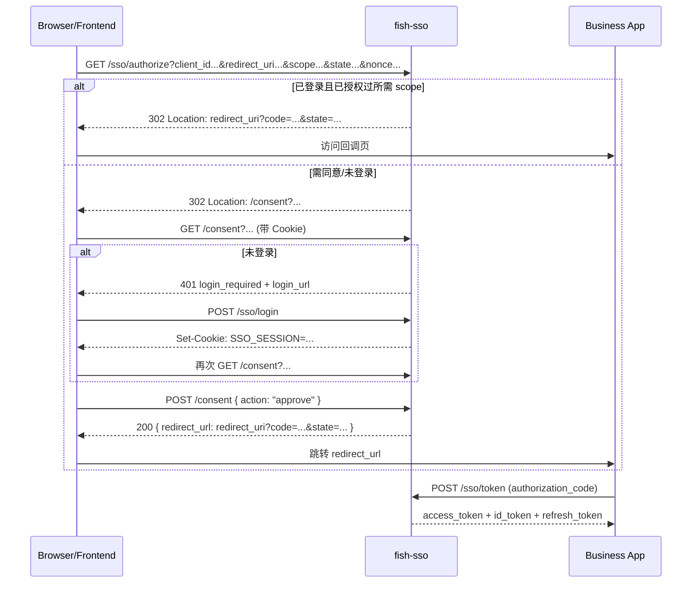

# Fish SSO

一个基于 `Spring Boot 3` 的轻量级 OAuth2/OIDC SSO 服务端，实现授权码登录、同意页授权、JWT 签发、用户信息查询、登出、令牌撤销、密码重置和登录防护。

本项目当前是后端 API 服务，不包含可直接使用的业务前端页面。  
如果你要把这份文档交给另一个 AI 生成前端，这个 README 已按前端接入视角组织。

## 1. 项目边界（先看）

- 有的：SSO 后端接口、会话 Cookie、授权码与令牌、用户信息、找回密码接口。
- 没有的：完整登录页 UI、同意页 UI、业务系统回调页 UI。
- 你需要实现的前端页面通常包括：
  - 登录页（提交 `/sso/login`）
  - 授权同意页（调用 `/consent` GET + POST）
  - OAuth 回调页（处理 `code` / `state`）
  - 用户中心页（调用 `/sso/userinfo`）
  - 忘记密码页（调用 `/sso/password/reset-code` 和 `/sso/password/reset`）

## 2. 技术栈

- Java 21
- Spring Boot 3.5.5
- Spring Web / Spring Security
- Spring Data JPA（MySQL）
- Spring Data Redis（会话、授权码、访问令牌、刷新令牌、验证码等）
- Nimbus JOSE JWT（JWT/JWKS）
- Maven

## 3. 目录结构

```text
fish-sso
├─ db
│  ├─ schema.sql                # 业务表
│  ├─ login_block_event.sql     # 登录封禁事件表
│  └─ data.sql                  # 测试数据
├─ docs
│  └─ password-reset-api.md     # 密码重置接口文档
├─ keys
│  └─ sso-jwt-keys.properties   # JWT 密钥持久化文件
├─ src/main/java/com/hollow/fishsso
│  ├─ config
│  ├─ controller
│  ├─ service
│  ├─ repository
│  ├─ model
│  ├─ exception
│  └─ util
├─ src/main/resources
│  ├─ application.yml
│  └─ application.yml.example
└─ pom.xml
```

## 4. 本地启动

### 4.1 依赖

- JDK 21
- Maven 3.9+
- MySQL 8+
- Redis 6+

### 4.2 初始化数据库

```sql
CREATE DATABASE fish_sso DEFAULT CHARACTER SET utf8mb4;
```

```bash
mysql -u <user> -p fish_sso < db/schema.sql
mysql -u <user> -p fish_sso < db/login_block_event.sql
mysql -u <user> -p fish_sso < db/data.sql
```

说明：
- `db/data.sql` 为演示用测试数据（建议本地联调用）。
- 生产环境请替换为你自己的用户与客户端数据。

### 4.3 配置文件

推荐从样例复制：

Linux/macOS:
```bash
cp src/main/resources/application.yml.example src/main/resources/application.yml
```

Windows PowerShell:
```powershell
Copy-Item src/main/resources/application.yml.example src/main/resources/application.yml
```

关键配置项：
- `server.port`：默认 `9000`
- `spring.datasource.*`：MySQL 连接
- `spring.data.redis.*`：Redis 连接
- `spring.mail.*`：邮件服务（密码重置）
- `app.sso.issuer`：签发者地址（建议填外部可访问地址）
- `app.sso.session-ttl`：会话有效期（Cookie Max-Age）
- `app.sso.auth-code-ttl`：授权码有效期
- `app.sso.access-token-ttl`：访问令牌有效期
- `app.sso.id-token-ttl`：ID Token 有效期
- `app.sso.refresh-token-ttl`：刷新令牌有效期
- `app.sso.jwt.*`：JWT 密钥路径与轮换策略
- `app.sso.login-protection.*`：登录失败封禁规则
- `app.sso.password-reset.*`：验证码有效期、重试上限、发送间隔

### 4.4 启动服务

```bash
mvn spring-boot:run
```

或：

```bash
mvn clean package
java -jar target/fish-sso-0.0.1-SNAPSHOT.jar
```

健康检查：

```bash
curl http://localhost:9000/health
```

## 5. 演示账号与客户端（来自 `db/data.sql`）

- 用户：
  - `alice / password123`
  - `bob / password123`
  - `charlie / password123`
- 客户端：
  - `test-client-1 / secret123`
  - `test-client-2 / secret123`
- 示例回调地址：
  - `test-client-1`：`http://localhost:8080/callback`、`http://localhost:8080/auth/callback`
  - `test-client-2`：`http://localhost:3000/callback`

## 6. 给前端 AI 的核心结论

- 这是授权码模式，`/sso/token` 要求 `client_secret`，属于机密客户端流程。
- 生产环境推荐前端走 BFF（前端后端）或服务端中转调用 `/sso/token`，不要把 `client_secret` 暴露到浏览器。
- `/sso/login` 成功后会下发 `SSO_SESSION`（`HttpOnly`, `SameSite=Lax`, `Path=/`），前端 JS 读不到该 Cookie。
- 同意页相关接口 `/consent` 依赖该 Cookie，前端请求时要带凭据（例如 `credentials: "include"`）。
- 当前代码未显式配置 CORS。若前端与 SSO 不是同源，浏览器直连会遇到跨域问题。  
  常见解法：反向代理同源（推荐）或在后端增加 CORS 配置。

## 7. OAuth2/OIDC 流程（前端视角）



## 8. 接口总览

| 功能 | 方法 | 路径 |
|---|---|---|
| 健康检查 | GET | `/health` |
| OIDC Discovery | GET | `/.well-known/openid-configuration` |
| JWKS | GET | `/sso/jwks` |
| 发起授权 | GET | `/sso/authorize` |
| 登录 | POST | `/sso/login` |
| 同意上下文 | GET | `/consent` |
| 提交同意 | POST | `/consent` |
| 换取令牌 | POST | `/sso/token` |
| 用户信息 | GET | `/sso/userinfo` |
| 撤销令牌 | POST | `/sso/revoke` |
| 登出 | POST | `/sso/logout` |
| 发送重置码 | POST | `/sso/password/reset-code` |
| 重置密码 | POST | `/sso/password/reset` |

## 9. 关键接口契约与示例

### 9.1 发起授权：`GET /sso/authorize`

请求参数：
- `client_id` 必填
- `redirect_uri` 必填
- `scope` 可选（空时默认客户端全部允许 scope）
- `state` 可选（建议始终传）
- `nonce` 可选（OIDC 建议传）

示例：

```text
http://localhost:9000/sso/authorize?client_id=test-client-1&redirect_uri=http://localhost:8080/callback&scope=openid%20profile%20email&state=abc123&nonce=n-0S6_WzA2Mj
```

响应：
- `302 Found`
- `Location` 可能是：
  - `/consent?...`（需要用户确认）
  - `http://localhost:8080/callback?code=...&state=...`（自动授权成功）

### 9.2 登录：`POST /sso/login`

`Content-Type: application/json`

请求体：

```json
{
  "username": "alice",
  "password": "password123",
  "return_to": "/consent?client_id=test-client-1&redirect_uri=http://localhost:8080/callback&scope=openid%20profile&state=abc123"
}
```

成功响应：
- 不传 `return_to`：`200 OK`
```json
{
  "session_id": "f35f9bcb-8ff5-4b1a-a5fd-0f99f2f4ac4a",
  "expires_at": 1774800000
}
```
- 传 `return_to`：`303 See Other`，并返回 `Location: <return_to>`
- 两种成功都会下发 `Set-Cookie: SSO_SESSION=...; HttpOnly; SameSite=Lax; Path=/`

常见失败：
- `401 invalid_credentials`
- `429 too_many_login_attempts`

### 9.3 获取同意页上下文：`GET /consent`

参数与 `/sso/authorize` 保持一致。  
需要带 Cookie（`SSO_SESSION`）。

成功：
```json
{
  "clientId": "test-client-1",
  "redirectUri": "http://localhost:8080/callback",
  "scopes": ["openid", "profile", "email"],
  "username": "alice",
  "displayName": "爱丽丝",
  "state": "abc123",
  "nonce": "n-0S6_WzA2Mj",
  "scope": "openid profile email"
}
```

未登录：
```json
{
  "error": "login_required",
  "error_description": "需要先登录",
  "login_url": "/login?return_to=%2Fconsent%3Fclient_id%3Dtest-client-1%26redirect_uri%3Dhttp%253A%252F%252Flocalhost%253A8080%252Fcallback%26scope%3Dopenid%2520profile%2520email%26state%3Dabc123"
}
```

### 9.4 提交同意：`POST /consent`

请求体（注意字段是下划线风格）：

```json
{
  "client_id": "test-client-1",
  "redirect_uri": "http://localhost:8080/callback",
  "scope": "openid profile email",
  "state": "abc123",
  "nonce": "n-0S6_WzA2Mj",
  "action": "approve"
}
```

成功（同意）：
```json
{
  "redirect_url": "http://localhost:8080/callback?code=9ad6f4bf-35cb-4f4d-8943-5cb4f973f970&state=abc123"
}
```

成功（拒绝）：
```json
{
  "redirect_url": "http://localhost:8080/callback?error=access_denied&error_description=%E7%94%A8%E6%88%B7%E6%8B%92%E7%BB%9D%E6%8E%88%E6%9D%83&state=abc123"
}
```

### 9.5 换取令牌：`POST /sso/token`

`Content-Type: application/x-www-form-urlencoded`

授权码模式：

```bash
curl -X POST "http://localhost:9000/sso/token" \
  -d "grant_type=authorization_code" \
  -d "code=<code>" \
  -d "redirect_uri=http://localhost:8080/callback" \
  -d "client_id=test-client-1" \
  -d "client_secret=secret123"
```

刷新模式：

```bash
curl -X POST "http://localhost:9000/sso/token" \
  -d "grant_type=refresh_token" \
  -d "refresh_token=<refresh_token>" \
  -d "client_id=test-client-1" \
  -d "client_secret=secret123"
```

响应示例：

```json
{
  "access_token": "<jwt>",
  "token_type": "Bearer",
  "expires_in": 1800,
  "scope": "openid profile email",
  "id_token": "<jwt>",
  "refresh_token": "<opaque-token>"
}
```

### 9.6 用户信息：`GET /sso/userinfo`

请求头：`Authorization: Bearer <access_token>`

```bash
curl -H "Authorization: Bearer <access_token>" \
  http://localhost:9000/sso/userinfo
```

响应示例：

```json
{
  "sub": "user-001",
  "username": "alice",
  "name": "爱丽丝",
  "email": "alice@example.com"
}
```

说明：
- `openid` scope 是调用 `/sso/userinfo` 的前置条件。
- `profile` 不在 scope 时，`username` 和 `name` 可能为 `null`。
- `email` 不在 scope 时，`email` 可能为 `null`。

### 9.7 撤销令牌：`POST /sso/revoke`

```bash
curl -X POST "http://localhost:9000/sso/revoke" \
  -d "token=<access_or_refresh_token>" \
  -d "client_id=test-client-1" \
  -d "client_secret=secret123"
```

响应：`200 OK` 空体（即使 token 不存在也返回 200）。

### 9.8 登出：`POST /sso/logout`

```bash
curl -i -X POST http://localhost:9000/sso/logout \
  --cookie "SSO_SESSION=<session-id>"
```

响应：

```json
{
  "message": "已登出"
}
```

同时返回清除会话 Cookie 的 `Set-Cookie`。

### 9.9 密码重置接口

发送验证码：

```http
POST /sso/password/reset-code
Content-Type: application/json

{
  "username": "alice",
  "email": "alice@example.com"
}
```

重置密码：

```http
POST /sso/password/reset
Content-Type: application/json

{
  "username": "alice",
  "new_password": "myNewSecurePassword123",
  "code": "582947"
}
```

更详细流程和前端建议见：`docs/password-reset-api.md`

## 10. 前端实现参考（可直接喂给 AI）

### 10.1 推荐路由

- `/login`
- `/oauth/consent`
- `/oauth/callback`
- `/profile`
- `/forgot-password`

### 10.2 前端发起授权

```ts
function buildAuthorizeUrl(base: string) {
  const url = new URL("/sso/authorize", base);
  url.searchParams.set("client_id", "test-client-1");
  url.searchParams.set("redirect_uri", "http://localhost:8080/callback");
  url.searchParams.set("scope", "openid profile email");
  url.searchParams.set("state", crypto.randomUUID());
  url.searchParams.set("nonce", crypto.randomUUID());
  return url.toString();
}

window.location.href = buildAuthorizeUrl("http://localhost:9000");
```

### 10.3 登录页示例（`/login`）

```ts
async function login(username: string, password: string) {
  const res = await fetch("http://localhost:9000/sso/login", {
    method: "POST",
    credentials: "include",
    headers: { "Content-Type": "application/json" },
    body: JSON.stringify({ username, password })
  });

  if (!res.ok) {
    const err = await res.json();
    throw new Error(err.error_description || "登录失败");
  }

  // 登录成功后，按你的业务路由跳转到 consent 或首页
  return await res.json();
}
```

### 10.4 同意页示例（`/oauth/consent`）

```ts
async function loadConsent(search: string) {
  const res = await fetch(`http://localhost:9000/consent${search}`, {
    method: "GET",
    credentials: "include"
  });

  if (res.status === 401) {
    const body = await res.json();
    if (body.error === "login_required") {
      // 建议跳到你自己的 /login，并把 return_to 带上
      const returnTo = `/oauth/consent${search}`;
      window.location.href = `/login?return_to=${encodeURIComponent(returnTo)}`;
      return null;
    }
  }

  if (!res.ok) {
    const err = await res.json();
    throw new Error(err.error_description || "获取同意页失败");
  }
  return await res.json();
}

async function submitConsent(payload: {
  client_id: string;
  redirect_uri: string;
  scope?: string;
  state?: string;
  nonce?: string;
  action: "approve" | "deny";
}) {
  const res = await fetch("http://localhost:9000/consent", {
    method: "POST",
    credentials: "include",
    headers: { "Content-Type": "application/json" },
    body: JSON.stringify(payload)
  });

  const body = await res.json();
  if (!res.ok) {
    throw new Error(body.error_description || "提交授权失败");
  }
  window.location.href = body.redirect_url;
}
```

### 10.5 回调页与换令牌（推荐 BFF）

前端只拿 `code/state` 后调用你自己的后端接口，例如 `/api/sso/exchange`，由后端再调用 SSO：

```ts
// 前端回调页
const params = new URLSearchParams(window.location.search);
const code = params.get("code");
const state = params.get("state");

await fetch("/api/sso/exchange", {
  method: "POST",
  headers: { "Content-Type": "application/json" },
  body: JSON.stringify({ code, state, redirect_uri: "http://localhost:8080/callback" })
});
```

```ts
// 你的 BFF/后端伪代码（Node 示例）
const form = new URLSearchParams({
  grant_type: "authorization_code",
  code,
  redirect_uri,
  client_id: process.env.SSO_CLIENT_ID!,
  client_secret: process.env.SSO_CLIENT_SECRET!
});

const ssoResp = await fetch("http://localhost:9000/sso/token", {
  method: "POST",
  headers: { "Content-Type": "application/x-www-form-urlencoded" },
  body: form
});
```

### 10.6 登出示例

```ts
await fetch("http://localhost:9000/sso/logout", {
  method: "POST",
  credentials: "include"
});
// 同时清理你前端本地缓存的用户态
```

## 11. OIDC 发现与 JWKS

### 11.1 Discovery

```bash
curl http://localhost:9000/.well-known/openid-configuration
```

返回关键字段包括：
- `issuer`
- `authorization_endpoint`
- `token_endpoint`
- `userinfo_endpoint`
- `jwks_uri`
- `revocation_endpoint`
- `end_session_endpoint`
- `scopes_supported`
- `grant_types_supported`

### 11.2 JWKS

```bash
curl http://localhost:9000/sso/jwks
```

用于校验 `access_token` / `id_token` 签名。

## 12. 错误响应规范

统一结构：

```json
{
  "error": "invalid_grant",
  "error_description": "授权码无效"
}
```

常见错误码（非完整列表）：

| error | 常见 HTTP 状态码 | 场景 |
|---|---|---|
| `invalid_client` | 400/401 | 客户端未注册或密钥错误 |
| `invalid_redirect_uri` | 400 | 回调地址不在白名单 |
| `invalid_scope` | 400 | 请求了未注册 scope |
| `invalid_credentials` | 401 | 用户名或密码错误 |
| `login_required` | 401 | 未登录或会话过期 |
| `invalid_grant` | 400 | code/refresh_token 无效或过期 |
| `unsupported_grant_type` | 400 | grant_type 不支持 |
| `invalid_token` | 401 | token 无效、过期、已撤销 |
| `insufficient_scope` | 403 | scope 不满足接口要求 |
| `too_many_login_attempts` | 429 | 登录被限流/封禁 |
| `rate_limited` | 429 | 重置码发送过于频繁 |
| `invalid_code` | 400 | 重置验证码错误或过期 |
| `code_exhausted` | 400 | 重置验证码尝试次数耗尽 |

## 13. 安全与生产注意事项

- 不要把 `client_secret` 放到浏览器端代码。
- 不要把真实数据库、Redis、邮箱密码提交到仓库。
- 当前 `SSO_SESSION` Cookie 的 `secure` 为 `false`（开发友好）；生产建议改为 `true` 并全站 HTTPS。
- 当前项目未配置 CORS；跨域前端部署时需反向代理同源或补充后端 CORS 配置。
- `state` / `nonce` 建议始终由前端生成并校验，避免 CSRF/重放风险。

## 14. 一键联调（最短路径）

1. 启动 MySQL、Redis，并执行 `db/*.sql`。  
2. 启动服务：`mvn spring-boot:run`。  
3. 浏览器打开授权地址：
```text
http://localhost:9000/sso/authorize?client_id=test-client-1&redirect_uri=http://localhost:8080/callback&scope=openid%20profile%20email&state=abc123
```
4. 在你的前端登录页调用 `/sso/login`（账号 `alice` / 密码 `password123`）。  
5. 同意页调用 `POST /consent` 提交 `action=approve`。  
6. 回调页拿到 `code` 后调用你的 BFF 换取 token。  
7. 用 `access_token` 调 `/sso/userinfo` 验证登录态。  

---

如果你要让另一个 AI 直接“按文档产出前端”，建议把本 README 的第 6～10 节和第 12 节作为主输入。

